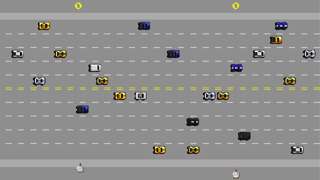

# Freeway

## Criando um game completo Freeway - by Academia Gamer 
*FONTE* https://www.youtube.com/watch?v=y8xletIHXU8&list=PLANK6lawiDPIzxqGsGPA_9EAUQ_EzisrB&index=2

## Intuito deste estudo:
- Sprite - Definido como background do Main e Win.
- RigidBody2D - Onde o Player tem contato com Win (barra de pontuação), Cars (Obstáculos). Lembrando, Gravity Scale = 0.
- Area2D - Player e Player2 andam somente no eixo Y.
- Timer - Executa a função a cada 0.3, com o propósito de instanciar carro lento e rápido.
- Label - Pontuação dos Players e Resultado.
- AudioStreamPlayer2D - Áudio para Node 2D.
- AudioStreamPlayer - Áudio para Node (sem 2D ou 3D).
- Button - Reinicia o jogo (com o método get_tree().reload_current_scene()) assim que terminar a partida. Fica no modo "hide" no inicio.
- signal - Assim que o Player colidir com RigidBody2D cujo o nome "Win", um emit_signal("point") será ativado. E o Node Main (cena principal) irá se conectar com este sinal do Player. Criando uma função para pontuação. 

~~Suricato Safado~~ 👾

